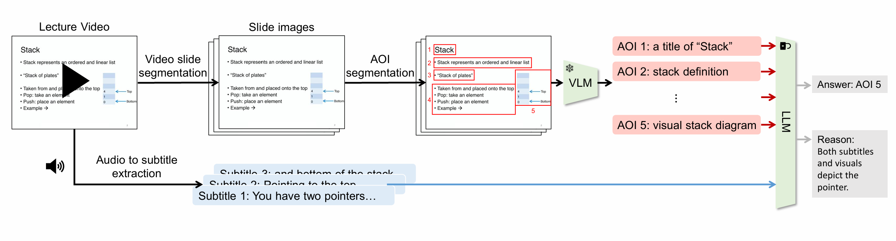

# AutoVAG: Automatic Video Analysis and Generation

AutoVAG is a comprehensive pipeline for extracting knowledge from educational videos (e.g., YouTube lectures) to train and evaluate multi-modal Large Language Models.



---

## 🧩 Methodology & Key Features

AutoVAG reframes cross-modal grounding as a **text-to-text reasoning task**, utilizing a "Divide-and-Conquer" strategy to handle complex, text-rich educational slides.

### The Three-Stage Pipeline
1.  **AOI Segmentation**: Decomposes a slide image into granular **Areas of Interest (AOIs)** using a Document Image Transformer (DiT).
2.  **Semantic Description**: Uses a Vision-Language Model (VLM) to generate rich, context-aware textual descriptions for each AOI.
3.  **LLM Alignment**: Formulates AOI selection as a Multiple-Choice Question (MCQ) task, allowing an LLM to reason and match subtitles to the most relevant AOI description.

---

## 📈 Benchmarks

The following results are from the original research paper. AutoVAG demonstrates significant improvements over baseline methods by leveraging rich textual descriptions and the reasoning capabilities of Large Language Models.

| Method | Paradigm | Top-1 Accuracy (EECS-Mandarin) |
| :--- | :--- | :---: |
| PolyViLT | Multi-modal Retrieval | 33.3% |
| Contrastive Learning | Text-to-Text (CLIP-based) | 44.7% |
| VLM-based Visual Grounding | End-to-end VLM (Qwen2.5-VL-3B) | 37.0% |
| VLM-based AOI Selection | Multimodal MCQ (Qwen2.5-VL-3B) | 32.2% |
| **AutoVAG (Ours)** | **LLM-based MCQ (Llama-3.2-3B)** | **52.3%** |

### 💡 Key Advantage: Explainability
Unlike traditional contrastive or VLM-based models, the LLM-based architecture provides **human-readable rationales** for its predictions. By leveraging the reasoning capabilities of the LLM, AutoVAG can explain *why* a specific AOI was selected for a given subtitle, significantly enhancing transparency and trust in educational settings.

> **Note on Training Data**: The results reported above were achieved using a large-scale, non-public research dataset comprising 37 EECS courses (~479,000 pairs). This repository provides the complete framework and tools to replicate this pipeline and achieve high performance on your own custom datasets.

---

## 🛠 Environments & Installation

Due to conflicting dependencies (Detectron2, Faster-Whisper, and Transformers), this project uses multiple Conda environments.

### 1. Preprocessing Environments

| Name | Usage | 
| :--- | :--- | 
| `preprocess-ASR` | Downloading & Transcription |
| `preprocess-AOI-det` | Vision/Object Detection |
| `preprocess-VLM` | Image Description |
| `autovag-train` | Model Training / Evaluation |

### Environment Setup: `preprocess-ASR`
Used for video downloading and speech-to-text.
```bash
# 0. Create environment
conda create -n preprocess-ASR python==3.11
conda activate preprocess-ASR

# 1. Install requirements
cd preprocess/ASR
pip install -r requirements.txt
```

### Environment Setup: `preprocess-AOI-det`
This environment requires a specific setup for **Detectron2** and **DiT**.
```bash
# 0. Create environment
conda create -n preprocess-AOI-det python==3.10
conda activate preprocess-AOI-det

# 1. Install PyTorch
pip3 install torch torchvision --index-url https://download.pytorch.org/whl/cu128

# 2. Install requirements
cd preprocess/AOI/object_detection
pip install -r requirements.txt

# 3. Install Detectron2 
pip install --no-build-isolation 'git+https://github.com/facebookresearch/detectron2.git'
# 4. Install additional dependencies
pip install shapely
pip install psutil
```

### Environment Setup: `preprocess-VLM`
Used for scene description using **Phi-4 MM** or **Pixtral-12B**.
```bash
# 0. Create environment
conda create -n preprocess-VLM python==3.11
conda activate preprocess-VLM

# 1. Install requirements
cd preprocess/AOI/phi4
pip install -r requirements.txt
```

### Environment Setup: `autovag-train` (Llama-Factory)
This environment is used for model training and **vLLM** evaluation.
```bash
# 0. Create environment
conda create -n autovag-train python==3.11
conda activate autovag-train

# 1. Install Llama-Factory and its dependencies
cd train/llama_factory
pip install -e . && \
pip install -r requirements/vllm.txt && \
pip install -r requirements/liger-kernel.txt && \
pip install -r requirements/metrics.txt && \
pip install -r fp8.txt && \
pip install -r fp8-te.txt
pip install wandb
```

---

## 📈 Pipeline: Preprocessing

Preprocessing is automated via a master script that handles environment switching. Use this script to run the entire flow or specific stages.

### 1. Make the script executable
```bash
chmod +x preprocess/run_pipeline.sh
```

### 2. Run the pipeline
Available stages: `all` (default), `asr`, `det`, `vlm`, `dataset`.

```bash
# Run all stages sequentially
./preprocess/run_pipeline.sh

# Run only transcription (ASR)
./preprocess/run_pipeline.sh asr

# Run only visual analysis (AOI)
./preprocess/run_pipeline.sh det

# Run only scene description (VLM)
./preprocess/run_pipeline.sh vlm
```

---

## 🚀 Training

Once the preprocessing is complete and the dataset is generated, you can start model training using **Llama-Factory**.

### Run Training
```bash
# 1. Activate the training environment
conda activate autovag-train

# 2. Navigate to the train directory
cd train

# 3. Start training using the provided config
llamafactory-cli train yaml/train.yaml
```

---

## 📊 Evaluation

The evaluation pipeline uses **vLLM** for high-throughput inference to calculate accuracy metrics for subtitle-to-AOI matching.

### How to Use

1. **Activate Environment**
   ```bash
   conda activate autovag-train
   # Basic Usage (Base Model)
   python evaluation/vllm_evaluate.py --valid_dataset datasets/val_data.json

   # Evaluate Fine-tuned Model
   python evaluation/vllm_evaluate.py \
       --valid_dataset datasets/val_data.json \
       --lora_path train/save/train_open_code
   ```

   **Parameters:**
   - `--valid_dataset`: Path to your validation JSON file.
   - `--lora_path`: Path to the LoRA adapter directory. If not provided, it defaults to evaluating the base Llama-3.2-3B model.

3. **Output Files**
   Evaluation results are automatically saved to the `eval_result/` folder:
   - `[lora_name]_[dataset].csv`: A detailed CSV containing question counts and correctness grouped by course and difficulty (number of candidates).
   - `evaluation_summary.csv`: A cumulative log of evaluation runs for easy comparison.


---

## 📂 Dataset Format

The pipeline generates training data in a standard instruction-following format:

```json
[
  {
    "course": "Linear Algebra",
    "aoi_count": 3,
    "conversations": [
      {
        "role": "user",
        "content": "Analyze the following subtitle and select the most relevant visual description..."
      },
      {
        "role": "assistant",
        "content": "2"
      }
    ]
  }
]
```


---

## 📂 Project Structure

```text
AutoVAG_open_code/
├── data/               # Raw and processed data
├── datasets/           # Final training datasets
├── evaluation/         # vLLM evaluation scripts
├── preprocess/         # Preprocessing pipeline
│   ├── AOI/            # Vision analysis
│   ├── ASR/            # Audio transcription
│   └── dataset/        # Formatting tools
└── train/              # Training configs & Llama-Factory
```

---

## 📜 Acknowledgments
- Lectures from **NTU Hung-yi Lee's** and **NTU Yun-Nung Chen's** courses.
- ASR Powered by [MediaTek-Research/Breeze-ASR-25](https://huggingface.co/MediaTek-Research/Breeze-ASR-25).
- VLM Powered by [microsoft/Phi-4-multimodal-instruct](https://huggingface.co/microsoft/Phi-4-multimodal-instruct).
- LLM Powered by [meta-llama/Llama-3.2-3B-Instruct](https://huggingface.co/meta-llama/Llama-3.2-3B-Instruct).
- Object Detection by [Microsoft DiT](https://github.com/microsoft/unilm/tree/master/dit).
- Tools: [Llama-Factory](https://github.com/hiyouga/LlamaFactory), [Faster-Whisper](https://github.com/SYSTRAN/faster-whisper), [vLLM](https://github.com/vllm-project/vllm).

---


